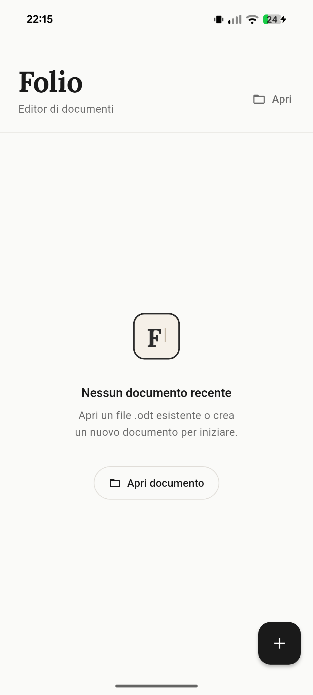
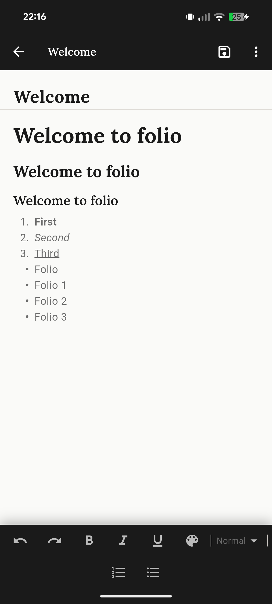

<div align="center">

<picture>
  <source media="(prefers-color-scheme: dark)" srcset="assets/svg/folio_logo_dark_animated.svg">
  
</picture>

# Folio

**A modern, native document editor for Android.**

Open, edit, and save `.odt` files with the quality and fluency of modern document editors — fast, lightweight, and focused.

[](https://github.com/carloceli2312/folio/actions/workflows/ci.yml)
[](LICENSE)
[](https://github.com/carloceli2312/folio/releases/latest)
[](#status)

[Download](https://github.com/carloceli2312/folio/releases/latest) · [Report a bug](https://github.com/carloceli2312/folio/issues/new?template=bug_report.md) · [Request a feature](https://github.com/carloceli2312/folio/issues/new?template=feature_request.md)

</div>

---

## Status

Folio is currently in **public beta**. The core editing flow is stable and tested on real `.odt` documents, but expect rough edges in advanced formatting, and some surfaces of the UI are still settling. Feedback and issue reports are very welcome.

- Current release: **v0.1.0 (beta)**
- Platforms: **Android 8.0+** (Oreo and above)
- Distribution: **GitHub Releases only** — not yet on the Play Store

## Why Folio

Most mobile document editors fall into one of two camps: either they are full office suites that feel heavy on a phone, or they are minimal text editors that lose formatting on save. Folio aims for a third path — a focused, native-feeling Android app that treats `.odt` as a first-class format, with the goal of reaching parity with Google Docs and Microsoft Word in formatting fidelity while staying small, fast, and free.

## Features

- **ODF parsing** — reads `.odt` files with support for headings, bold/italic/underline, lists, hyperlinks, colors, font sizes, images, and tables
- **Rich text editing** — full editing experience with a formatting toolbar
- **Save and load** — overwrite the original file or save a new copy locally
- **Android SAF integration** — pick documents from anywhere on the device without extra permissions on Android 10+
- **Import and export** — open and export plain text (`.txt`) and Markdown (`.md`)
- **Recent files** — quickly reopen recently edited documents from the home screen
- **Auto-save drafts** — debounced background drafts protect work against unexpected exits

## Screenshots

<div align="center">

| Splash | Home | Editor |
|:---:|:---:|:---:|
|  |  |  |

</div>

## Download

The latest signed APK is available on the [Releases page](https://github.com/carloceli2312/folio/releases/latest).

1. Download the APK matching your device architecture (`arm64-v8a` for most modern phones).
2. On your Android device, allow installation from unknown sources for your file manager or browser.
3. Open the APK and follow the prompts.

> Folio is distributed outside the Play Store, so Android may warn you about the installation source. The APKs are signed with a stable release key; future updates will use the same key.

## Build from source

Folio is a standard Flutter app. You need the Flutter SDK installed (`^3.11.1`) and an Android device or emulator.

```bash
git clone https://github.com/carloceli2312/folio.git
cd folio
flutter pub get
flutter run
```

To produce a release build locally:

```bash
flutter build apk --release --split-per-abi
```

The resulting APKs are written under `build/app/outputs/flutter-apk/`.

## Tech stack

- **Flutter** (Dart, Android target)
- **flutter_quill** — rich text editor with the Delta format
- **archive** — ZIP packaging for ODF containers
- **xml** — ODF content XML parsing
- **file_picker** — Android SAF document access
- **path_provider** — local storage
- **google_fonts** — typography
- **shared_preferences** — recent files and settings

## Contributing

Contributions, bug reports, and feature requests are welcome. For anything non-trivial, please open an issue first so we can discuss the approach before you spend time on a PR. See [CONTRIBUTING.md](CONTRIBUTING.md) for the basics.

## License

Folio is released under the [MIT License](LICENSE).

---

<div align="center">
Made with care by <a href="https://github.com/carloceli2312">Carlo Giuseppe Celi</a>.
</div>
